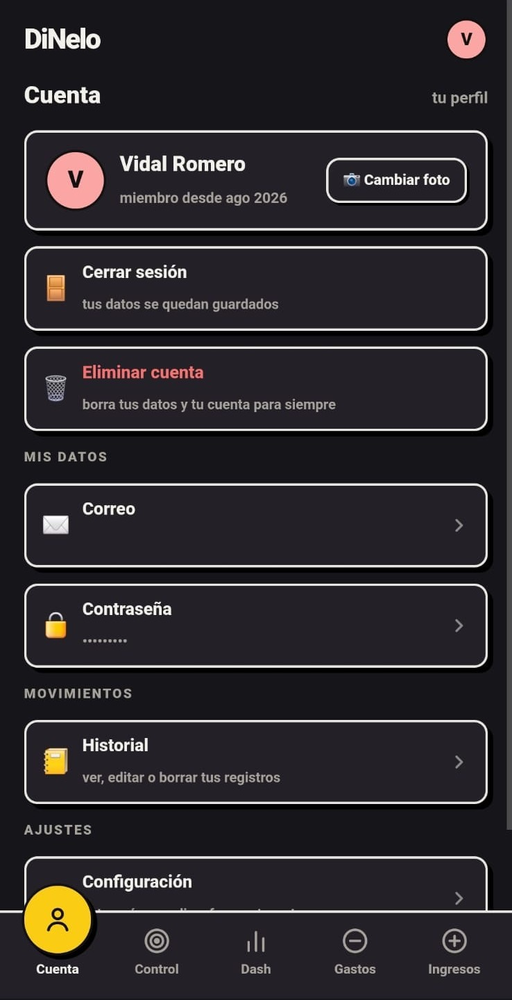
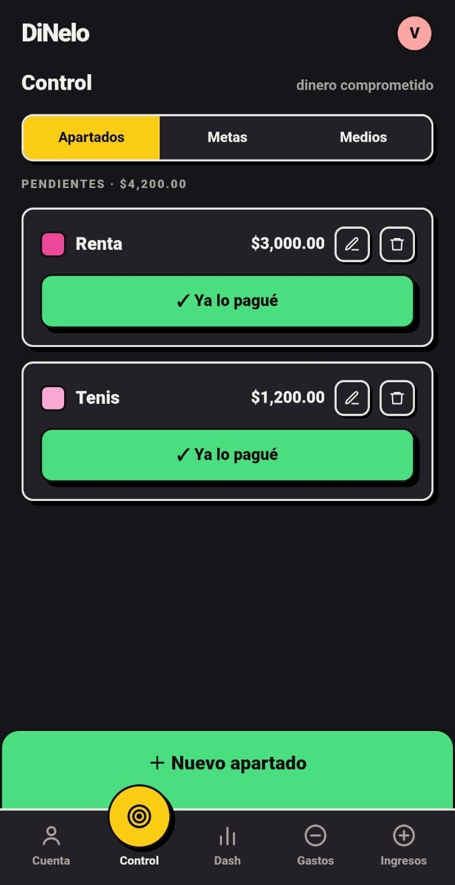
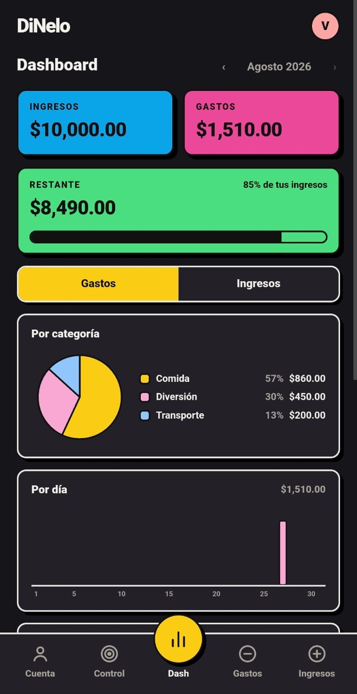
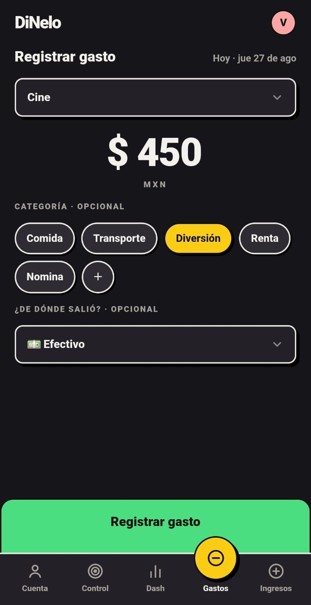
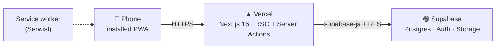
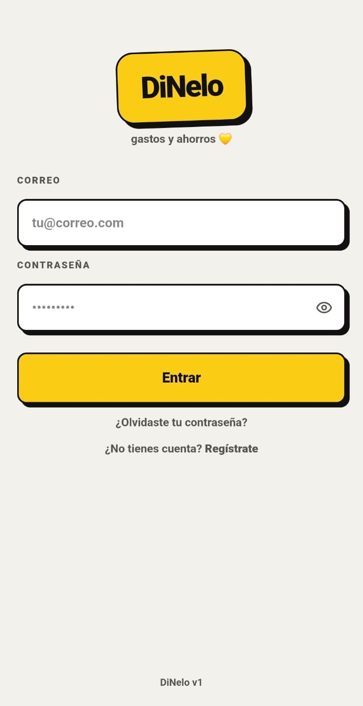
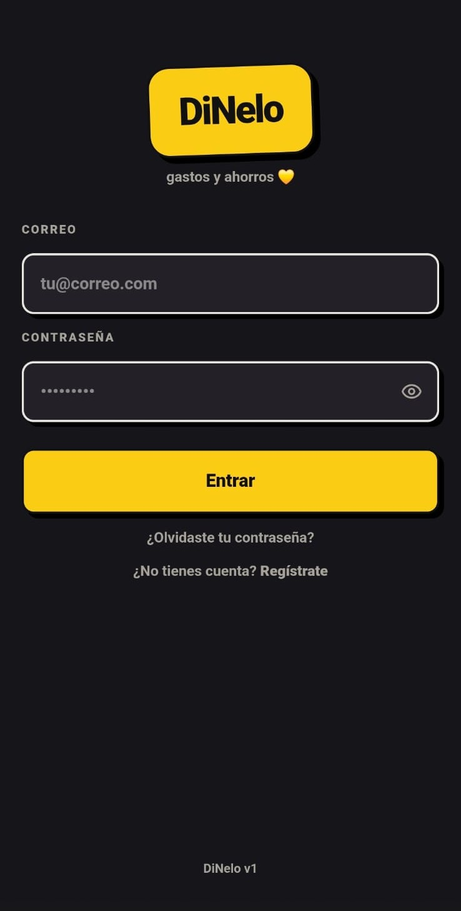

<p align="center">
  
</p>

<h1 align="center">DiNelo</h1>

<p align="center"><b>expenses & savings 💛</b><br/>
An app to log an expense in seconds, one-handed, and know how much you truly have left.</p>

<p align="center">
  <a href="https://dinelo.vercel.app"></a>
  <a href="https://github.com/kenshivr/dinelo/actions/workflows/ci.yml"></a>
  <a href="https://pagespeed.web.dev/analysis?url=https%3A%2F%2Fdinelo.vercel.app"></a>
  
  
  
</p>

<p align="center"><a href="README.md">🌐 Léelo en español</a></p>

---

## What is it?

DiNelo is a **personal finance app for people, not accountants**. It was born as an app
for two and today anyone can create an account. There are no convoluted budgets or
twenty-page reports: it has what you use every day.

There is one top priority: **logging an expense without friction** — standing at the store,
phone in one hand. Everything else was built around that.

## What it does

| Tab             | What you'll find                                                                                                                                                                                                        |
| --------------- | ------------------------------------------------------------------------------------------------------------------------------------------------------------------------------------------------------------------------ |
| 💸 **Expenses** | Concept, amount, done. Category and payment method are optional. Quick category creation without leaving the screen.                                                                                                    |
| 💰 **Income**   | Same flow, in green. Payroll, a sale, payday…                                                                                                                                                                           |
| 📊 **Dash**     | Income vs expenses for the month, **Remaining** (what you have today, across your whole history) and **Free** (minus pending set-asides, with a traffic light), pie chart by category or concept, daily chart and a comparison against last month. |
| 📌 **Control**  | **Envelopes**: when you get paid, you split what's already committed (rent, utilities…) and the Dash tells you what's truly free; "✓ Already paid it" turns it into a real expense. **Goals**: named savings with a progress bar and contributions. |
| 👤 **Account**  | History with search and filters (edit or delete what slipped), Settings (categories, payment methods and frequents in the order you choose, light/dark theme), photo, email, password and account deletion.                                         |

**Details that matter**

- **Frequents** feed the concept dropdown: "Rent", "Payday", "Coffee" one tap away.
- Deleting a category or payment method **never blocks**: whatever used it becomes "Uncategorized" / "No method", and the dialog tells you how many records are affected before you confirm.
- Dates come from **the phone, not the server** — an 11 pm expense lands on the right day.
- Amounts in **MXN with cents always visible** (`$1,500.00`), bank-statement style.
- **Your data is yours**: every account sees only its own records, enforced by RLS at the database level, not by the app.
- Offline, the app tells you instead of breaking; online, the phone is a cache and Supabase is the source of truth.

<p align="center">
  
  
  
  
</p>

## How it's built



| Layer        | Technology                                                                                                                                                                                                                                                                                                                        |
| ------------ | --------------------------------------------------------------------------------------------------------------------------------------------------------------------------------------------------------------------------------------------------------------------------------------------------------------------------------- |
| Framework    |    |
| UI           |   · custom **Bloque** theme                                                                                                            |
| Data & auth  |  Postgres + Auth (email/password) + Storage + **RLS**                                                                                                                                                                     |
| PWA          |  manifest, service worker, offline page, shortcuts                                                                                                                                                                                                       |
| Deploy       |  `git push` to `main` = a new version on every phone                                                                                                                                                                             |
| Quality      |  Testing Library · TypeScript `strict` · ESLint · CI on GitHub Actions (types, lint and tests on every push) · Lighthouse **100/100/100/100** on mobile and desktop                                                              |

Server Components read from Supabase with the user's session; writes are **Server Actions**
that return an error message or `null`. There is no custom API and no client-side global state.

## The "Bloque" design

Warm neobrutalism. **2 px** borders, **hard** shadows with no blur (`4px 4px 0`), `system-ui`
typography at weights 800/900 and **black text on every color block**, always. Color blocks
don't change between light and dark themes — they are the identity; only backgrounds, cards
and neutral borders switch.

<p>
  
  
  
  
  
  
  
  
  
  
  
</p>

The active tab is a **yellow circle popping out of the nav** that travels with you as you switch sections.

<p align="center">
  
  
</p>

## Running it locally

You need Node 20+, [pnpm](https://pnpm.io) and a [Supabase](https://supabase.com) account (the free tier is enough).

### 1. Clone and install

```bash
git clone https://github.com/kenshivr/dinelo
cd dinelo
pnpm install
```

### 2. Create the database with `seed.sql`

[`supabase/seed.sql`](supabase/seed.sql) is **the entire database in a single file**: the 8 tables
(profiles, categories, payment methods, frequents, transactions, goals, contributions, envelopes),
their indexes, the RLS policies that make every account see only its own data, the trigger that
sets up a new profile with base categories and methods on sign-up, and the profile picture
bucket with its permissions.

1. Create a **new, empty project** in Supabase.
2. Open the **SQL Editor**, paste the full content of `seed.sql` and hit **Run**. Once.
3. Go to **Authentication → Providers** and keep **Email** enabled.
4. In **Authentication → Sign In / Providers → Email**, turn **Confirm email** off (if you leave it
   on, sign-up asks to check your inbox before entering) and set **Minimum password length** to **8**.

> Don't run it on a project that already has the app: it's not a migration, it's the final state to
> start from scratch. Any future schema change is made by editing this same file.

### 3. Environment variables

Copy the keys from **Project Settings → API Keys** into a `.env.local`:

```bash
NEXT_PUBLIC_SUPABASE_URL=https://xxxx.supabase.co
NEXT_PUBLIC_SUPABASE_PUBLISHABLE_KEY=sb_publishable_...

# Only for the admin report (Account → Report). Optional.
SUPABASE_SECRET_KEY=sb_secret_...
ADMIN_USER_ID=uuid-of-your-account   # Authentication → Users, after creating your account

# Email notice when someone writes to you from Account → "Send me a message"
# (Nodemailer + Gmail app password). Optional: without it the message is still
# saved and shows up in the Report.
CORREO_USUARIO=you@gmail.com
CORREO_PASSWORD=app-password
CORREO_DESTINO=you@gmail.com         # where the notice goes; defaults to CORREO_USUARIO
```

### 4. Start it

```bash
pnpm dev
```

Open `http://localhost:3000`, create your account from **Regístrate** and log your first expense.

> The service worker is off in development on purpose. Offline mode and installation are tested in production.

## Install it as an app

|             |                                                                                    |
| ----------- | ---------------------------------------------------------------------------------- |
| **iPhone**  | Safari → Share → **Add to Home Screen**                                            |
| **Android** | Chrome offers **Install app** on its own. Install from Chrome, not from Firefox.   |

Long-pressing the icon (Android) opens "Log expense", "Log income" or the Dash directly.

## Maintenance: zero

- **Deploy**: push to `main` and Vercel does the rest.
- **Supabase free pauses the project after ~7 idle days**: a GitHub Actions workflow
  ([`anti-pausa.yml`](.github/workflows/anti-pausa.yml)) pings it on Mondays and Thursdays.
- GitHub disables crons on public repos after 60 days without commits: the same workflow
  makes an empty commit if the repo has been quiet for 50 days. The workflow takes care of itself.

## Decisions that explain everything else

| Decision                             | Why                                                                                                                       |
| ------------------------------------ | ------------------------------------------------------------------------------------------------------------------------- |
| **PWA, not a native app**            | Shipping on iOS without the App Store costs 99 USD/year or re-signing every 7 days. The PWA dodges it and updates with a push. |
| **Everything is personal**           | It was born shared between two; when it opened up, every account sees only its own data and RLS guarantees it at the database. |
| **Category and method are optional** | Requiring them slows down capture. What matters is concept and amount; the rest can be filled in if you want.             |
| **Deleting never blocks**            | A `restrict` in the database becomes an incomprehensible "it failed". Better "Uncategorized" plus a heads-up beforehand.  |
| **Neutral Spanish, informal "tú"**   | The app talks like a person, not like a bank, and reads naturally in any Spanish-speaking country.                        |
| **No state management library**      | RSC + Server Actions + `revalidatePath` cover everything. Something will be added when a real user asks for it.           |

> The big decisions are documented with context and tradeoffs in [`docs/adr`](docs/adr/README.md) (Spanish),
> and the first real production bug has its own [postmortem](docs/postmortem-2026-08-20-registro.md) (Spanish).

## Status

**v1 finished** (August 2026) and in production. Uncommitted ideas: push notifications,
E2E tests with Playwright and a custom domain.

---

<p align="center">Made with 💛 by <a href="https://github.com/kenshivr">kenshivr</a></p>
