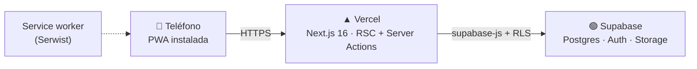

<p align="center">
  
</p>

<h1 align="center">DiNelo</h1>

<p align="center"><b>gastos y ahorros 💛</b><br/>
Una app para anotar un gasto en segundos, con una mano, y saber cuánto te queda de verdad.</p>

<p align="center">
  <a href="https://dinelo.vercel.app"></a>
  <a href="https://github.com/kenshivr/dinelo/actions/workflows/ci.yml"></a>
  <a href="https://pagespeed.web.dev/analysis?url=https%3A%2F%2Fdinelo.vercel.app"></a>
  
  
  
</p>

<p align="center"><a href="README.en.md">🌐 Read this in English</a></p>

---

## ¿Qué es?

DiNelo es una app de **finanzas personales para personas, no para contadores**. Nació como una app
para dos y hoy cualquiera puede crear su cuenta. No tiene presupuestos complicados ni reportes de
veinte páginas: tiene lo que usas todos los días.

La prioridad número uno es una sola: **capturar un gasto sin fricción** — parado en la tienda, con el
teléfono en una mano. Todo lo demás se construyó alrededor de eso.

## Lo que hace

| Tab             | Qué encuentras                                                                                                                                                                                                             |
| --------------- | -------------------------------------------------------------------------------------------------------------------------------------------------------------------------------------------------------------------------- |
| 💸 **Gastos**   | Concepto, monto y listo. Categoría y medio de pago son opcionales. Alta rápida de categorías sin salir de la pantalla.                                                                                                     |
| 💰 **Ingresos** | Mismo flujo, en verde. Nómina, venta, quincena…                                                                                                                                                                            |
| 📊 **Dash**     | Ingresos vs gastos del mes, **Restante** y **Libre** con semáforo, pastel por categoría o concepto, gráfica por día y comparativa contra el mes anterior.                                                                  |
| 📌 **Control**  | **Apartados**: al cobrar repartes lo ya comprometido (renta, luz…) y el Dash te dice cuánto queda libre de verdad; "✓ Ya lo pagué" lo convierte en gasto real. **Metas**: ahorros con nombre, barra de progreso y aportes. |
| 👤 **Cuenta**   | Historial con búsqueda y filtros (edita o borra lo que se te fue), Configuración (categorías, medios, frecuentes, tema claro/oscuro), foto, correo, contraseña y eliminar cuenta.                                          |

**Detalles que importan**

- Los **frecuentes** alimentan el desplegable de concepto: "Renta", "Quincena", "Café" a un toque.
- Borrar una categoría o un medio **nunca bloquea**: lo que lo usaba queda "Sin categoría" / "Sin medio", y el diálogo avisa cuántos registros son antes de confirmar.
- La fecha es **la del teléfono**, no la del servidor — un gasto a las 11 pm cae en el día correcto.
- Montos en **MXN con centavos siempre visibles** (`$1,500.00`), estilo estado de cuenta.
- **Tus datos son tuyos**: cada cuenta ve solo lo suyo, garantizado por RLS en la base, no por la app.
- Sin conexión la app avisa en vez de romperse; con conexión, el teléfono es cache y Supabase es la fuente de verdad.

<!-- Capturas: agregar 3-4 screenshots del teléfono (Gastos, Dash, Control, Cuenta) en docs/ y referenciarlas aquí -->

## Cómo está hecha



| Capa         | Tecnología                                                                                                                                                                                                                                                                                                                       |
| ------------ | -------------------------------------------------------------------------------------------------------------------------------------------------------------------------------------------------------------------------------------------------------------------------------------------------------------------------------- |
| Framework    |    |
| UI           |   · tema propio **Bloque**                                                                                                             |
| Datos y auth |  Postgres + Auth (correo/contraseña) + Storage + **RLS**                                                                                                                                                                  |
| PWA          |  manifest, service worker, página offline, shortcuts                                                                                                                                                                                                     |
| Deploy       |  `git push` a `main` = nueva versión en todos los teléfonos                                                                                                                                                                      |
| Calidad      |  Testing Library · TypeScript `strict` · ESLint · CI en GitHub Actions (tipos, lint y tests en cada push) · Lighthouse **100/100/100/100** en móvil y desktop                                                                |

Server Components leen de Supabase con la sesión del usuario; las escrituras son **Server Actions**
que devuelven un mensaje de error o `null`. No hay API propia ni estado global en el cliente.

## Diseño: "Bloque"

Neobrutalismo cálido. Bordes de **2 px**, sombras **duras** sin blur (`4px 4px 0`), tipografía
`system-ui` en pesos 800/900 y **texto negro sobre cualquier bloque de color**, siempre. Los bloques
de color no cambian entre tema claro y oscuro — son la identidad; solo cambian fondos, tarjetas y
bordes neutros.

<p>
  
  
  
  
  
  
  
  
  
  
  
</p>

La tab activa es un **círculo amarillo que sobresale del nav** y viaja contigo al cambiar de sección.

## Correrla en local

Necesitas Node 20+, [pnpm](https://pnpm.io) y una cuenta en [Supabase](https://supabase.com) (el free tier alcanza).

### 1. Clona e instala

```bash
git clone https://github.com/kenshivr/dinelo
cd dinelo
pnpm install
```

### 2. Crea la base de datos con `seed.sql`

[`supabase/seed.sql`](supabase/seed.sql) es **toda la base de datos en un solo archivo**: las 8 tablas
(perfiles, categorías, medios, frecuentes, movimientos, metas, aportes, apartados), sus índices, las
políticas RLS que hacen que cada cuenta vea solo lo suyo, el trigger que da de alta el perfil con
categorías y medios base al registrarse, y el bucket de fotos de perfil con sus permisos.

1. Crea un **proyecto nuevo y vacío** en Supabase.
2. Abre **SQL Editor**, pega el contenido completo de `seed.sql` y dale **Run**. Una sola vez.
3. Ve a **Authentication → Providers** y deja **Email** activo.
4. En **Authentication → Sign In / Providers → Email**, apaga **Confirm email** (si lo dejas encendido, el
   registro pide revisar el correo antes de entrar) y pon **Minimum password length** en **8**.

> No lo corras sobre un proyecto que ya tenga la app: no es una migración, es el estado final para
> empezar de cero. Cualquier cambio futuro de esquema se hace editando este mismo archivo.

### 3. Variables de entorno

Copia las llaves de **Project Settings → API Keys** a un `.env.local`:

```bash
NEXT_PUBLIC_SUPABASE_URL=https://xxxx.supabase.co
NEXT_PUBLIC_SUPABASE_PUBLISHABLE_KEY=sb_publishable_...

# Solo para el informe de admin (Cuenta → Informe). Opcional.
SUPABASE_SECRET_KEY=sb_secret_...
ADMIN_USER_ID=uuid-de-tu-cuenta   # Authentication → Users, tras crear tu cuenta
```

### 4. Arranca

```bash
pnpm dev
```

Abre `http://localhost:3000`, crea tu cuenta desde **Regístrate** y registra el primer gasto.

> El service worker está apagado en desarrollo a propósito. Lo offline y la instalación se prueban en producción.

## Instalarla como app

|             |                                                                                |
| ----------- | ------------------------------------------------------------------------------ |
| **iPhone**  | Safari → Compartir → **Agregar a pantalla de inicio**                          |
| **Android** | Chrome ofrece **Instalar app** solo. Instálala desde Chrome, no desde Firefox. |

Mantener apretado el ícono (Android) abre directo "Registrar gasto", "Registrar ingreso" o el Dash.

## Mantenimiento: cero

- **Deploy**: push a `main` y Vercel hace el resto.
- **Supabase free pausa el proyecto tras ~7 días sin actividad**: un workflow de GitHub Actions
  ([`anti-pausa.yml`](.github/workflows/anti-pausa.yml)) le hace ping lunes y jueves.
- GitHub apaga los crons de repos públicos tras 60 días sin commits: el mismo workflow hace un
  commit vacío si el repo lleva 50 días quieto. El workflow se cuida solo.

## Decisiones que explican el resto

| Decisión                         | Por qué                                                                                                                |
| -------------------------------- | ---------------------------------------------------------------------------------------------------------------------- |
| **PWA, no app nativa**           | Publicar en iOS sin App Store cuesta 99 USD/año o re-firmar cada 7 días. La PWA lo esquiva y se actualiza con un push. |
| **Todo es personal**             | Nació compartida entre dos; al abrirse a más gente, cada cuenta ve solo lo suyo y el RLS lo garantiza en la base.      |
| **Categoría y medio opcionales** | Obligarlos frena la captura. Lo que importa es concepto y monto; lo demás se completa si quieres.                      |
| **Borrar nunca bloquea**         | Un `restrict` en la base se convierte en un "no se pudo" incomprensible. Mejor "Sin categoría" y avisar antes.         |
| **Español neutro, tuteo**        | La app habla como una persona, no como un banco, y se entiende en cualquier país.                                      |
| **Sin librería de estado**       | RSC + Server Actions + `revalidatePath` cubren todo. Se agregará algo cuando un usuario real lo pida.                  |

## Estado

**v1 terminada** (agosto 2026) y en producción. Ideas sin compromiso: notificaciones push, pruebas
E2E con Playwright y dominio propio.

---

<p align="center">Hecho con 💛 por <a href="https://github.com/kenshivr">kenshivr</a></p>
